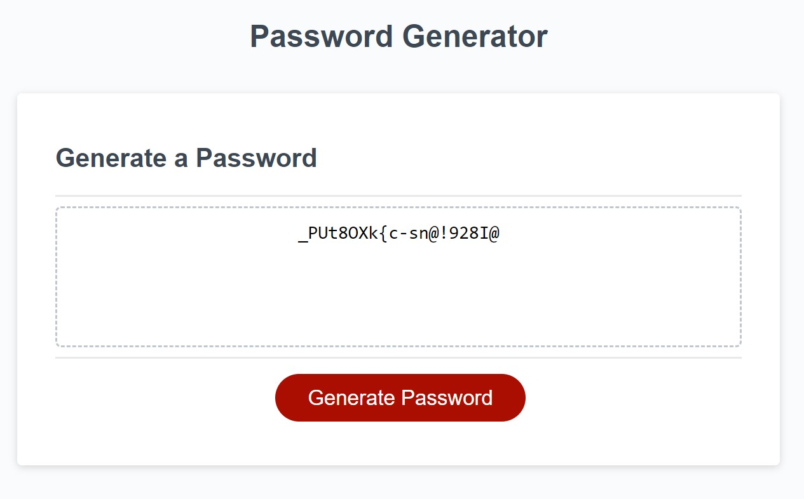

# JavaScript Password Generator Challenge

The purpose of this challenge was to create an application that generates a secure password when a button is clicked. The application first prompts the user for input with a number of options, such as asking if they'd like to include capital letters or special characters ($@%&*, etc) in their password. 

Once these options have been selected, the user can click the 'Generate Password' option and will receive their unique password.

# Prerequisites

No prerequisites are needed to use this project, as it can be viewed directly on the web browser.

# Demo

The live site can be found at the following URL - 

https://dombrown95.github.io/Password-Generator/

A screenshot of the live site can be seen below - 

# Getting Started

The project can be viewed by opening the HTML file in a browser or through clicking the GitHub pages link included in this ReadMe file. To generate a password, users should click the 'Generate Password' button and follow any input messages.

# Acknowledgments

Links used: 

Creating a confirm option - 
https://stackoverflow.com/questions/18473137/making-a-confirm-box
https://stackoverflow.com/questions/29898641/alert-confirmation-javascript/29898915

Picking random element from arrays - 
https://stackoverflow.com/questions/1527803/generating-random-whole-numbers-in-javascript-in-a-specific-range
https://www.w3schools.com/jsref/jsref_random.asp

Using user options in a function - 
https://stackoverflow.com/questions/13453537/difference-between-var-options-options-and-options-options

Concat in Javascript -
https://www.w3schools.com/jsref/jsref_concat_string.asp

